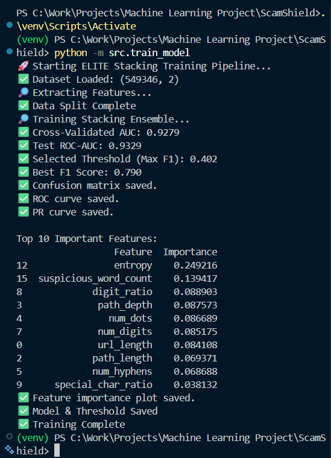

  

# 🛡️ ScamShield AI

### Hybrid Ensemble-Based URL Phishing Detection System

---

## 📌 Overview

ScamShield AI is an advanced URL phishing detection system built using classical machine learning techniques. The system combines engineered structural URL features with a stacking ensemble model to detect malicious phishing URLs.

To improve real-world reliability, a reputation-based whitelist (derived from top global domains) is integrated, forming a hybrid detection architecture.

The model was trained on over 549,000 labeled URLs and achieves strong classification performance with robust generalization.

---

## 🧠 System Architecture

The system consists of four major components:

### 1️⃣ Feature Engineering Layer

Extracts structural features from raw URLs, including:

- URL length  
- Hostname length  
- Path depth  
- Digit ratio  
- Special character ratio  
- Subdomain count  
- TLD length  
- Shannon entropy  
- Suspicious keyword count  
- HTTPS indicator  
- IP address detection  

These features capture common phishing URL patterns.

---

### 2️⃣ Machine Learning Layer

A stacking ensemble model is used:

Base learners:
- Random Forest (balanced)
- Gradient Boosting
- Logistic Regression

Meta learner:
- Logistic Regression

Stratified cross-validation ensures stable and reliable performance.

---

### 3️⃣ Threshold Calibration

Instead of using the default 0.5 classification threshold, the decision boundary is optimized using F1-score maximization, balancing precision and recall.

Selected Threshold: ~0.40

---

### 4️⃣ Reputation Filtering (Hybrid Logic)

A whitelist derived from the Tranco Top Domains list is used to reduce false positives for highly trusted domains.

Final decision logic:

If domain is in whitelist → SAFE  
Else → ML prediction using optimized threshold  

---

## 📊 Model Performance

Cross-Validated ROC-AUC: ~0.928  
Test ROC-AUC: ~0.933  
Best F1 Score: ~0.79  
Optimized Threshold: ~0.402  

The model demonstrates strong phishing detection capability while maintaining balanced precision and recall.

---

## 📈 Evaluation Plots

The following evaluation visualizations are generated:

- ROC Curve (models/roc_curve.png)
- Precision-Recall Curve (models/pr_curve.png)
- Confusion Matrix (models/confusion_matrix.png)
- Feature Importance Ranking (models/feature_importance.png)

Feature importance analysis shows that entropy, suspicious keyword count, and digit ratio are dominant predictive signals.

---

## 🚀 How to Run

### 1️⃣ Create Virtual Environment

python -m venv venv

Activate:

venv\Scripts\activate

---

### 2️⃣ Install Dependencies

pip install -r requirements.txt

---

### 3️⃣ Train Model

python -m src.train_model

---

### 4️⃣ Run Streamlit App

streamlit run app/app.py

---

## 🧪 Testing

Run automated tests:

pytest

Includes:
- Feature extraction validation
- Model prediction verification

---

## ⚠️ Limitations

- The system relies solely on structural URL features.
- It does not analyze webpage content.
- It does not use external threat intelligence APIs.
- Domain age and WHOIS data are not included.
- Advanced adversarial mimicry may evade detection.

---

## 🔮 Future Improvements

- Domain age and WHOIS integration
- Content-based HTML feature extraction
- Model calibration curve analysis
- Real-time reputation API integration
- Deployment via Docker

---

## 🏆 Key Contributions

- Advanced structural feature engineering
- Stacking ensemble architecture
- Cross-validated evaluation
- F1-optimized threshold selection
- Hybrid ML + reputation filtering system
- Production-style UI implementation

---

## 📚 Technologies Used

- Python
- scikit-learn
- pandas
- matplotlib
- seaborn
- Streamlit
- pytest

---

## 📌 Project Type

Classical Machine Learning (No Deep Learning)

---

This project demonstrates a production-style classical ML pipeline with explainability, calibration, and hybrid decision logic suitable for academic evaluation and portfolio presentation.

## 📸 Screenshots

  

  

  

  

  

  

