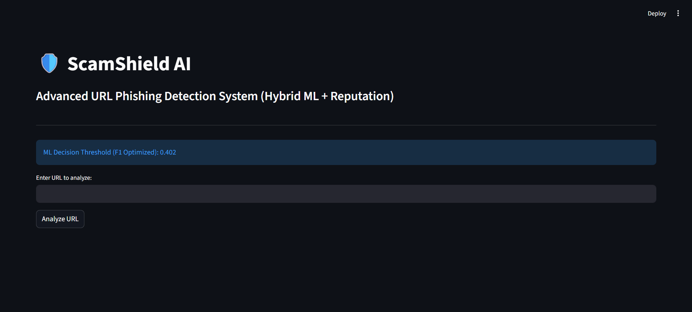
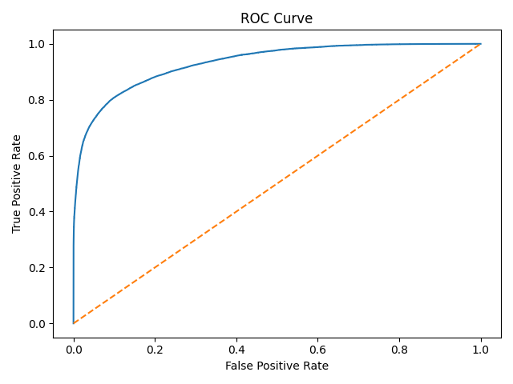
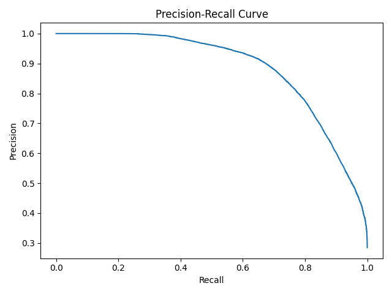
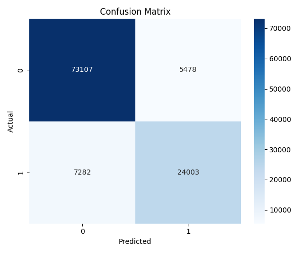
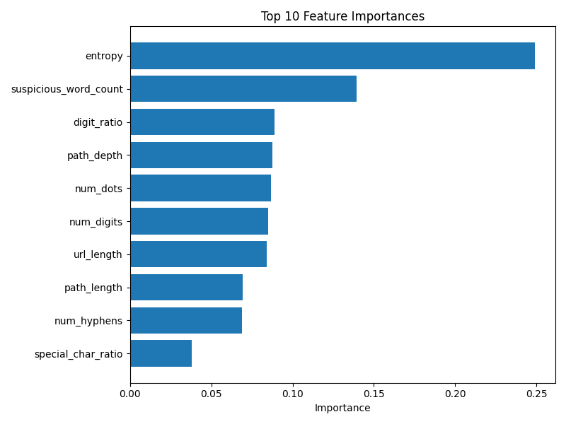
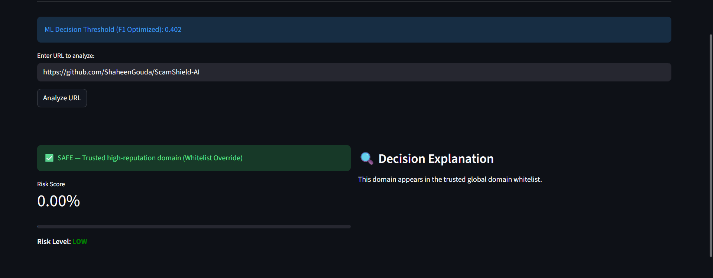
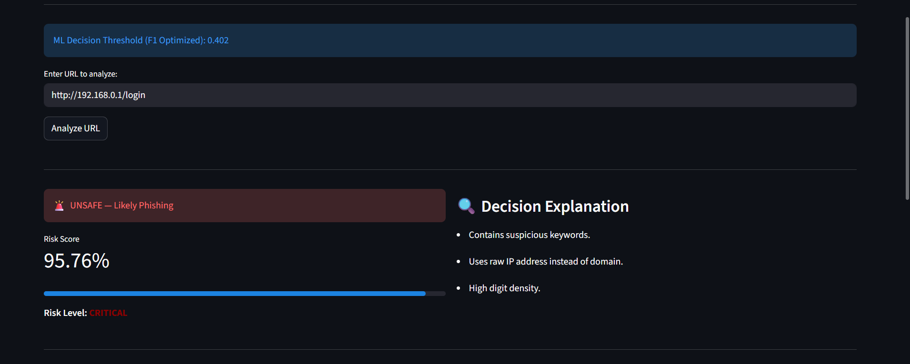

<p align="center">
  
</p>

# 🛡️ ScamShield AI
### Hybrid Ensemble-Based URL Phishing Detection System

---

## 🚀 Overview

ScamShield AI is an advanced URL phishing detection system built using classical machine learning and hybrid reputation filtering.

The system combines engineered structural URL features with a stacking ensemble model to detect malicious phishing URLs at scale.

### ✅ Key Highlights

- Trained on 549,000+ labeled URLs  
- Stacking Ensemble (Random Forest + Gradient Boosting + Logistic Regression)  
- Cross-Validated ROC-AUC ≈ 0.93  
- F1-Optimized Decision Threshold ≈ 0.402  
- Hybrid ML + Domain Whitelist Filtering  
- Interactive Streamlit Deployment  

---

## 🧠 System Architecture

### 1️⃣ Feature Engineering

Extracted structural features include:

- URL length
- Hostname length
- Path depth
- Subdomain count
- Digit ratio
- Special character ratio
- Shannon entropy
- Suspicious keyword count
- HTTPS indicator
- IP address detection

---

### 2️⃣ Machine Learning Model

Stacking Ensemble:

Base learners:
- Random Forest (balanced)
- Gradient Boosting
- Logistic Regression

Meta learner:
- Logistic Regression

Stratified cross-validation ensures stable performance.

---

### 3️⃣ Threshold Optimization

The decision threshold is optimized using F1-score maximization instead of the default 0.5.

Selected threshold ≈ 0.402.

---

### 4️⃣ Hybrid Reputation Filtering

A whitelist derived from top global domains (Tranco list) reduces false positives.

Decision logic:

If domain ∈ whitelist → SAFE  
Else → ML prediction using optimized threshold  

---

## 📊 Model Performance

| Model | ROC-AUC |
|-------|---------|
| Logistic Regression | ~0.79 |
| Random Forest | ~0.91 |
| Gradient Boosting | ~0.87 |
| **Stacking Ensemble** | **~0.93** |

Best F1 Score ≈ 0.79  
Phishing Recall ≥ 80%

---

## 📈 Evaluation Visualizations

### ROC Curve
<p align="center">
  
</p>

### Precision-Recall Curve
<p align="center">
  
</p>

### Confusion Matrix
<p align="center">
  
</p>

### Feature Importance
<p align="center">
  
</p>

### Safe Test
<p align="center">
  
</p>

### Unsafe Test
<p align="center">
  
</p>

---

## 🚀 How to Run

### 1️⃣ Create Virtual Environment

```bash
python -m venv venv
```

Activate (Windows):

```bash
venv\Scripts\activate
```

---

### 2️⃣ Install Dependencies

```bash
pip install -r requirements.txt
```

---

### 3️⃣ Train Model

```bash
python -m src.train_model
```

---

### 4️⃣ Run Streamlit App

```bash
streamlit run app/app.py
```

---

## 🧪 Testing

Run automated tests:

```bash
pytest
```

---

## ⚠️ Limitations

- No webpage content analysis  
- No WHOIS/domain age features  
- No external threat intelligence APIs  
- Structural-only detection may miss advanced adversarial attacks  

---

## 🔮 Future Improvements

- Domain age integration  
- HTML content analysis  
- Model calibration curves  
- Docker deployment  

---

## 📚 Technologies Used

- Python  
- scikit-learn  
- pandas  
- matplotlib  
- seaborn  
- Streamlit  
- pytest  

---

## 📌 Project Type

Classical Machine Learning (No Deep Learning)
